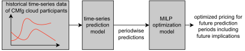
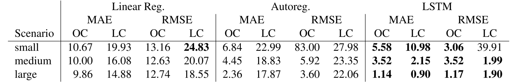
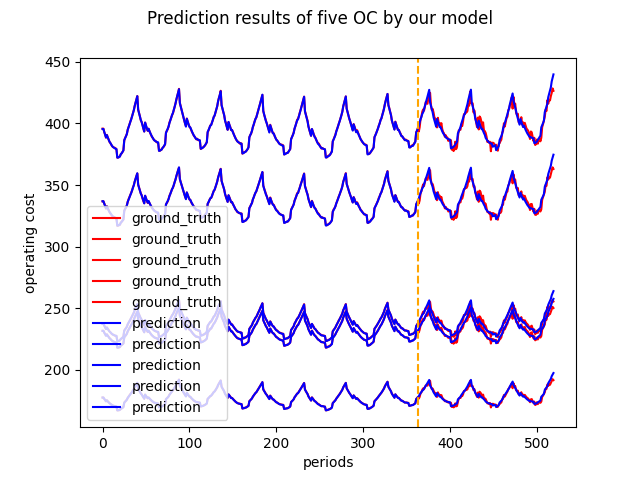
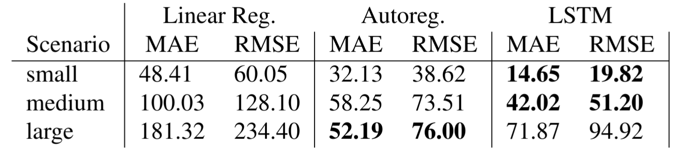

# ICME 2022 - A Machine Learning Approach for Revenue Management in  Cloud Manufacturing

This Repo is a sample project for initializing new projects. And an own tiny best practice derived from multiple research and coding projects.

## Motivation

Cloud Manufacturing matches supplier capacities and customer demands via an algorithmic agent. 
The agent aims to maximize its own and the platform participant’s revenue, hence the platform’s gross revenue. 
Volatilities in supply and demand, as well as individual pricing models and willingness to pay, exacerbate the problem for deterministic solvers. 
In Revenue Management, comparable problems are approached with linear programming and regression models. 
Within this repo, we introduce a new Machine Learning (ML) based approach: Machine Learning for Cloud Manufacturing Cost Prediction (ML-ConCord). 
ML-ConCord aims to improve prediction quality for Revenue Management in Cloud Manufacturing by combining a recurrent neural network (RNN) with a linear programming pricing algorithm. 
We evaluate our approach on a self-generated dataset and compare its performance with standard regression-based approaches.
Models and datasets are published on GitHub.

## Requirements

Requirements for a conda venv are saved in `icme-2022.yml`.

For creating a conda env run `conda env create -f venv-icme-2022.yml` in your terminal.


## Quickrun

For running the training and evaluation of the model run `main.py`.


## Data

The datasets can either be generated with the simulation model saved in `/sim_model`.

You can also access the datasets [here](https://drive.google.com/drive/folders/1LPL9qPmR-qQ2Y5tgkIhx5NVVVWcTlYb5?usp=sharing).

Once downloaded, save the datasets to `/data`. 
You can run `convert_to_timeseries.py` to convert the .json file into time-series, which the models takes as input of the ML model.


## Methods

Our approach takes historic time-series data of Cloud Manufacturing Platforms as input.
Operational costs (OC) and logistic costs (LC) are predicted with an ML model, in our case a standard LSTM. 
Finally, a Mixed Integer Linear Programming model calculates the optimal pricing for a point in the future.



**Fig. 1: Model pipeline**


## Results

We trained all models on three datasets (small, medium, large), with a train/test split of 70/30. 
We evaluated the model performance with mean absolute error (MAE) and root mean squared error (RMSE).
The employed LSTM outperforms the employed linear, and autoregressive models in all employed datasets, for the prediction 
of operational cost (OC) and logistic cost (LC).

**Tab. 1: Results for prediction model. Benchmarked with linear and autoregression. Metrics mean absolute error (MAE) and mean squared error (MSE)**


`

**Fig. 2: Predictions of LSTM**

The calculated pricing of our method performs well on small and medium datasets, but gets surpassed by autoregression on the large dataset. 

**Tab. 2: Results for method. Benchmarked with linear and autoregression predictions. Metrics mean absolute error (MAE) and mean squared error (MSE)**



---
When using contents of this repo please cite:

```
@INPROCEEDINGS{Ehrhardt2022,
  author={Adomat, Vincent and Ehrhardt, Jonas and Kober, Christian and Ahanpanjeh, Maryam and Wulfsberg, Jens},
  booktitle={16th CIRP Conference on Intelligent Computation in Manufacturing Engineering (ICME'22), Napoli}, 
  title={A Machine Learning Approach for Revenue Management in Cloud Manufacturing}, 
  year={2022},
  pages={},
  doi={}}
```

---

## LICENSE

Licensed under the Apache License, Version 2.0 (the "License"); you may not use it except in compliance with the License. A copy of the License is included in the project, see the file LICENSE.


 